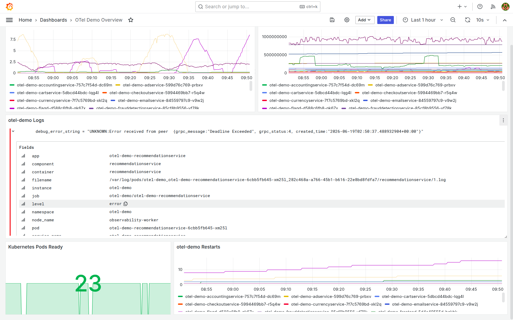
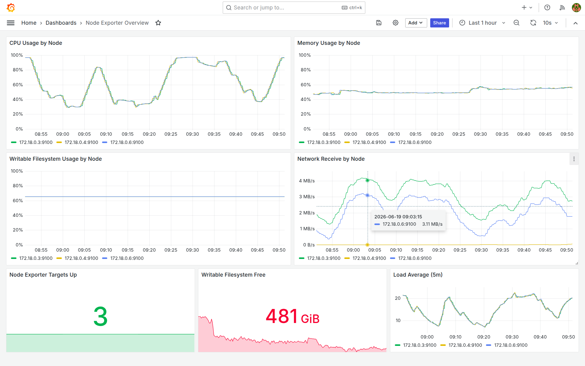
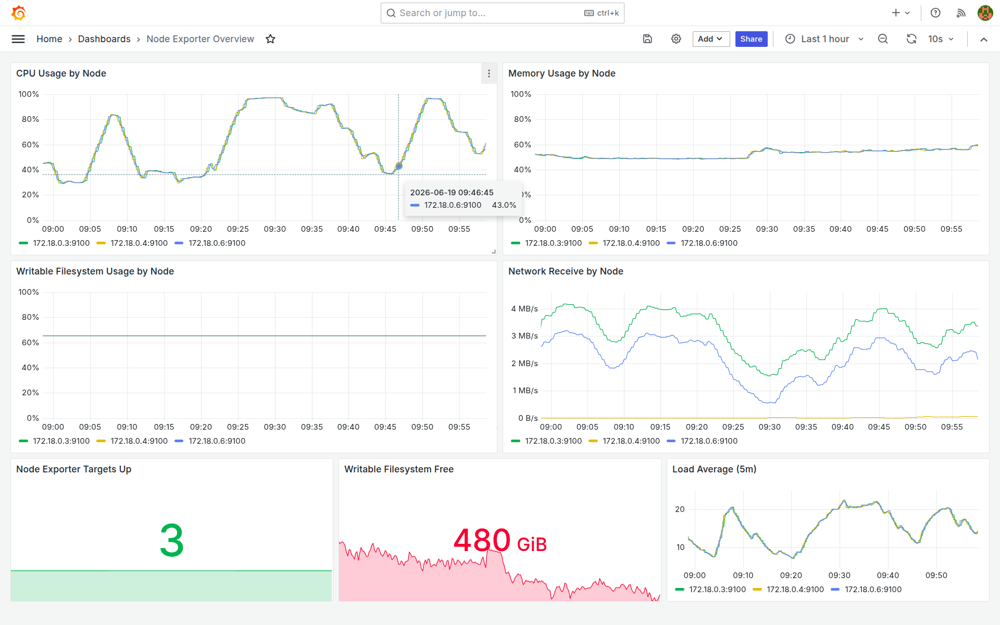

# Cloud Observability Stack

## Directory Structure

```
/
├── Makefile                                    # Main orchestrator with targets for all steps
├── images/                                     # Example screenshots of Grafana dashboards
├── manifests/
│   ├── otel-demo-overview-dashboard.yaml       # OTel Demo Grafana dashboard
│   └── node-exporter-dashboard.yaml            # Node Exporter Grafana dashboard
├── scripts/
│   ├── common.sh                               # Shared functions, logging, error handling
│   ├── 01-create-cluster.sh                    # Create kind cluster
│   ├── 02-label-control-plane.sh               # Label control plane nodes
│   ├── 03-cloud-provider-kind.sh               # Install cloud-provider-kind
│   ├── 04-helm-repos.sh                        # Add Helm chart repositories
│   ├── 05-prometheus-stack.sh                  # Deploy Prometheus/Grafana (kube-prometheus-stack)
│   ├── 06-lgtm-stack.sh                        # Deploy LGTM (Loki, Grafana, Tempo, Mimir)
│   ├── 07-otel-collector.sh                    # Deploy OpenTelemetry Collector
│   ├── 08-otel-demo.sh                         # Deploy OpenTelemetry Demo Application
│   ├── 09-grafana-dashboard.sh                 # Create Grafana dashboard
│   ├── 10-loadbalancer-ips.sh                  # Wait for LoadBalancer IPs
│   ├── 11-traffic-generation.sh                # Generate synthetic traffic
│   └── 12-verification.sh                      # Verify all resources
└── values/                                     # Helm chart values overrides
    ├── grafana.yaml
    ├── loki.yaml
    ├── mimir.yaml
    ├── otel-collector.yaml
    ├── otel-demo.yaml
    ├── prometheus.yaml
    ├── promtail.yaml
    └── tempo.yaml
```

## Quick Start

### Full Setup (All 12 Steps)

```bash
git clone https://github.com/lmhinnel/lgtm-gogo.git
cd lgtm-gogo
make help
make setup
```

### Individual Steps

Run any step independently:

```bash
make step-1    # Create kind cluster
make step-2    # Label control plane nodes
make step-3    # Install cloud-provider-kind
make step-4    # Add Helm repositories
make step-5    # Deploy Prometheus stack
make step-6    # Deploy LGTM stack
make step-7    # Deploy OpenTelemetry Collector
make step-8    # Deploy OpenTelemetry Demo App
make step-9    # Create Grafana dashboard
make step-10   # Wait for LoadBalancer IPs
make step-11   # Generate synthetic traffic
make step-12   # Run verification
```

### Useful Commands

```bash
make help       # Show all available targets
make urls       # Get UI access URLs and component status
make verify     # Run verification checks
make status     # Show cluster and resource status
make logs       # Show cloud-provider-kind logs
make clean      # Delete cluster and cleanup
```

## Architecture Overview

### Step-by-Step Deployment Flow

1. **Cluster Setup** (Steps 1-3)
   - Create kind cluster with specific node image
   - Label control plane node with monitoring node label
   - Install cloud-provider-kind for LoadBalancer IP assignment

2. **Helm Repository Configuration** (Step 4)
   - Add required Helm repositories:
     - `prometheus-community` (Prometheus stack)
     - `grafana` (Grafana, Loki, Mimir, Tempo)
     - `open-telemetry` (OpenTelemetry Collector)
     - `open-telemetry-helm-charts` (OpenTelemetry Demo)

3. **Observability Backend** (Steps 5-6)
   - **Step 5**: Prometheus stack with Prometheus Operator and node-exporter (metrics scraping)
   - **Step 6**: LGTM components (logs, traces, metrics aggregation):
     - Loki: Log aggregation
     - Grafana: Visualization
     - Tempo: Trace backend
     - Mimir: Metrics backend
     - Promtail: Log shipper

4. **Telemetry Collection** (Step 7)
   - OpenTelemetry Collector deployment
   - Receives telemetry from applications
   - Exports to Tempo (traces), Mimir (metrics), Loki (logs)

5. **Demo Application** (Step 8)
   - OpenTelemetry Demo application (microservices)
   - Instrumented with OpenTelemetry SDKs
   - Generates traces, metrics, logs for demonstration

6. **Observability Configuration** (Step 9)
   - Create Grafana dashboard for OTel Demo application
   - Configure datasources (Prometheus, Loki, Tempo)

7. **Access & Validation** (Steps 10-12)
   - **Step 10**: Wait for LoadBalancer IP assignment
   - **Step 11**: Generate synthetic traffic to create observable signals
   - **Step 12**: Verify all components are running and healthy

## Script Internals

### Common Functions (`scripts/common.sh`)

Each script sources `common.sh` which provides:

- **Logging Functions**
  - `info "message"` - Informational messages (green)
  - `warn "message"` - Warning messages (yellow)
  - `error "message"` - Error messages (red)

- **Error Handling**
  - `on_error()` - Trap function for error handling
  - Continues execution on errors (set -uo pipefail)

- **Helper Functions**
  - `step_timer START_TIME END_TIME` - Calculate and display step duration
  - `wait_pods NAMESPACE LABEL_SELECTOR TIMEOUT` - Wait for pods to be ready
  - `get_lb_ip NAMESPACE SERVICE_NAME` - Get LoadBalancer IP

### Configuration Constants

All scripts use these constants (defined in `common.sh`):

```bash
CLUSTER_NAME="observability"                # Kind cluster name
NAMESPACE_MONITORING="monitoring"           # Observability backend namespace
NAMESPACE_DEMO="otel-demo"                  # Demo application namespace
KIND_NODE_IMAGE="kindest/node:v1.32.8"      # Kubernetes version
```

### Helm Values Pattern

Each script that deploys a Helm chart follows this pattern:

```bash
# Calculate paths
SCRIPT_DIR="$(cd "$(dirname "${BASH_SOURCE[0]}")" && pwd)"
PROJECT_ROOT="$(dirname "$SCRIPT_DIR")"

# Deploy with values file
helm upgrade --install RELEASE_NAME CHART_NAME \
  --namespace NAMESPACE \
  --create-namespace \
  -f "${PROJECT_ROOT}/values/filename.yaml"
```

## Accessing the Observability Stack

After completing `make setup`, use this command to get all access URLs:

```bash
make urls
```

This displays:
- Grafana dashboard URL with credentials
- Demo application URL
- Component health status
- Quick copy-paste links

### Grafana UI
- URL: `http://GRAFANA_HOST` (from `make urls` or `make step-10`)
- Username: `admin`
- Password: `admin`
- Default datasources:
  - **Prometheus**: Metrics from kube-prometheus-stack and scraped targets
  - **Loki**: Logs from all workloads via Promtail
  - **Tempo**: Traces from OpenTelemetry Collector

### Demo Application
- URL: `http://DEMO_IP:8080`
- Generates continuous traces, metrics, and logs
- Available endpoints:
  - `/` - Frontend (shopping application)
  - `/api/products` - Product service
  - `/api/cart` - Shopping cart service
  - `/api/checkout` - Checkout service

### Direct Component Access
- **Tempo**: `http://TEMPO_IP:3100` (only accessible within cluster)
- **Mimir**: `http://MIMIR_IP:9009` (only accessible within cluster)
- **Loki**: `http://LOKI_IP:3100` (only accessible within cluster)

## Screenshots

The `images/` folder contains example Grafana views from this stack:

### OTel Demo Metrics

`images/demo-metrics.png` shows the OTel Demo Overview dashboard with application-level metrics for the Astronomy Shop demo.



### OTel Demo Logs

`images/demo-log-detail.png` shows log exploration for the OTel demo workload through the Loki datasource in Grafana.



### Node Exporter Metrics

`images/node-exporter-metrics.png` shows the Node Exporter Overview dashboard with node CPU, memory, filesystem, network, and load signals.



## Troubleshooting

### Check Script Execution Status

```bash
# Show all pods in both namespaces
make status

# Show detailed pod information
kubectl get pods -n monitoring -o wide
kubectl get pods -n otel-demo -o wide

# Check logs of a specific component
kubectl logs -n monitoring deployment/lgtm-grafana
kubectl logs -n monitoring deployment/otel-collector
```

### View cloud-provider-kind Logs

```bash
make logs

# Or manually:
tail -f /tmp/cloud-provider-kind.log
```

### Restart a Component

```bash
# Restart Grafana
kubectl rollout restart deploy/lgtm-grafana -n monitoring

# Restart OTel Collector
kubectl rollout restart deploy/otel-collector -n monitoring

# Restart demo app
kubectl rollout restart deploy/otel-demo-frontendproxy -n otel-demo
```

### Check LoadBalancer IP Assignment

```bash
# Get Grafana IP
kubectl get svc lgtm-grafana -n monitoring -o jsonpath='{.status.loadBalancer.ingress[0].ip}'

# Get Demo app IP
kubectl get svc otel-demo-frontendproxy -n otel-demo -o jsonpath='{.status.loadBalancer.ingress[0].ip}'
```

### View Helm Deployments

```bash
# List all Helm releases
helm list --all-namespaces

# Get values of a release
helm get values RELEASE_NAME -n NAMESPACE

# Show all Helm charts deployed
helm list -n monitoring
helm list -n otel-demo
```

## Cleanup

Remove all deployed resources:

```bash
make clean
```

This will:
- Stop cloud-provider-kind process
- Delete kind cluster

### Manual Cleanup (if needed)

```bash
# Stop background processes
pkill -f cloud-provider-kind

# Delete kind cluster
kind delete cluster --name kubecon

# Delete Docker containers
docker ps -a | grep kubecon | awk '{print $1}' | xargs docker rm -f
```

## Customization

### Modify Helm Values

Each chart's values can be customized by editing `values/*.yaml`:

- `values/prometheus.yaml` - kube-prometheus-stack settings, including node-exporter
- `values/grafana.yaml` - Grafana UI settings
- `values/mimir.yaml` - Metrics backend configuration
- `values/loki.yaml` - Log backend configuration
- `values/tempo.yaml` - Trace backend configuration
- `values/otel-collector.yaml` - OpenTelemetry Collector configuration
- `values/otel-demo.yaml` - Demo app configuration

Changes take effect on the next `make step-N` execution.

### Customize Step Execution

Individual scripts can be modified to:
- Change Kubernetes versions
- Modify resource requests/limits
- Update chart versions
- Add new helm chart values

Each script is self-contained and can be executed independently:

```bash
bash scripts/05-prometheus-stack.sh
bash scripts/06-lgtm-stack.sh
```

## Performance Considerations

- **First-time setup**: ~5-10 minutes (depends on image pull speeds)
- **Step 10 (LoadBalancer IPs)**: Can take 5-30 seconds depending on cluster performance
- **Step 11 (Traffic generation)**: ~60 seconds (1 iteration/second, 60 iterations)
- **Pod startup**: Most pods ready within 30-60 seconds

## Monitoring Deployment Progress

Watch pod deployment in real-time:

```bash
# Monitoring namespace
kubectl get pods -n monitoring -w

# Demo namespace
kubectl get pods -n otel-demo -w

# All resources
kubectl get all -n monitoring && kubectl get all -n otel-demo
```
